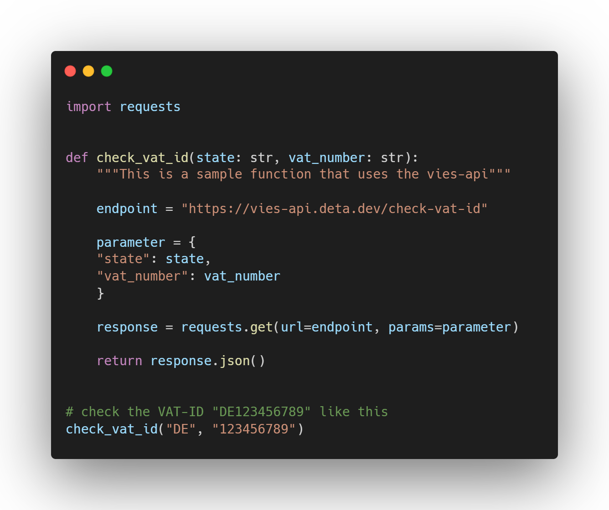

# vies-api

Simple API for validating VAT-IDs

## Documentation

You can find the full API-Documentation on:

 [https://vies-api.deta.dev/docs](https://vies-api.deta.dev/docs#/VAT%20Validation/check_vat_id_check_vat_id_get)
 
 [https://vies-api.deta.dev/redoc](https://vies-api.deta.dev/redoc#operation/check_vat_id_check_vat_id_get)

## Usage

If you want validate a VAT-ID you can use the example python code below.

## Disclaimer

The vies-api is build on top of the SOAP service of the European Commission. You can find more information on it [here](https://ec.europa.eu/taxation_customs/vies/technicalInformation.html).

The data comes from the databases of the EU Member States. The vies-api has no control over the data and cannot guarantee the correctness.